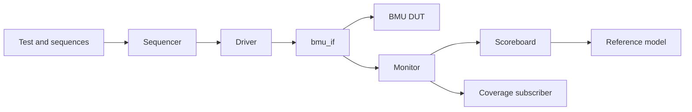

# BMU UVM Verification

A specification-driven **SystemVerilog/UVM verification environment** for a 32-bit Bit Manipulation Unit (BMU). The project verifies legal BMU and CSR data-selection modes, registered result timing, reset and hold behavior, control legality, functional coverage, and reproducible DUT mismatches.

> **Project status:** the verification environment and planned functional stimulus reached closure. DUT sign-off remains open because the regression identified result and error mismatches and because toggle coverage is not closed.

## Contents

- [Project Objective](#project-objective)
- [Verification Scope](#verification-scope)
- [Approved Behavioral Rules](#approved-behavioral-rules)
- [UVM Architecture](#uvm-architecture)
- [Checking Strategy](#checking-strategy)
- [Stimulus Strategy](#stimulus-strategy)
- [Functional Coverage](#functional-coverage)
- [Regression Snapshot](#regression-snapshot)
- [Documented Findings](#documented-findings)
- [Repository Structure](#repository-structure)
- [Requirements](#requirements)
- [Running the Project](#running-the-project)
- [Generated Outputs](#generated-outputs)
- [Project Documentation](#project-documentation)
- [Limitations and Sign-off Status](#limitations-and-sign-off-status)

## Project Objective

The main verification question is:

> Does the BMU produce the correct result and error response for every approved request, at the correct cycle?

The DUT is verified as a **black box**. Expected behavior comes from the BMU specification and approved clarifications, not from copying the RTL implementation into the testbench.

The environment separates three responsibilities:

- **Sequences** generate legal, corner, mixed, control, and negative stimulus.
- **Reference model and scoreboard** determine whether DUT behavior is correct.
- **Functional coverage** records which planned situations were exercised.

Functional coverage therefore measures stimulus closure; it does not replace result checking.

## Verification Scope

The approved baseline contains **21 legal modes**:

### BMU operations

| Category | Operations |
|---|---|
| Logic | OR, ORN, XOR, XNOR |
| Shift, rotate, and bit index | SRL, SRA, ROR, BINV |
| Arithmetic | SH2ADD, SUB |
| Comparison | SLT, SLTU, signed MAX |
| Count and extension | CTZ, CPOP, SEXT.B |
| Data manipulation | PACK, GREV/REV8 |

### CSR data-selection modes

| Mode | Selected source |
|---|---|
| CSR read | `csr_rddata_in` |
| CSR write A | `a_in` |
| CSR write B | `b_in` when `csr_imm` is asserted |

Additional verification covers:

- legal NOP behavior;
- synchronous reset;
- `valid_in` update and hold behavior;
- consecutive requests and mixed traffic;
- invalid and conflicting `ap` combinations;
- CSR/BMU control conflicts;
- supported and unsupported GREV mode selections;
- error behavior when `valid_in` is low;
- recovery and reset after error-producing controls.

`scan_mode=1` and BMU features without an approved checker definition are outside the functional scope.

## Approved Behavioral Rules

The testbench follows these clarified rules:

1. **One-cycle registered result**  
   A request accepted in cycle N produces its observable `result_ff` response at the monitor sample in cycle N+1.

2. **Result hold**  
   When `valid_in=0`, `result_ff` retains its previous registered value.

3. **Current-control error detection**  
   `error` reflects the legality of the current control packet and does not depend on `valid_in`.

4. **Synchronous active-low reset**  
   When `rst_l=0` at the active clock edge, `result_ff` and `error` clear to zero.

5. **Functional scan setting**  
   `scan_mode` remains zero during functional verification.

6. **Specification corrections**
   - `CTZ(0)=32`.
   - A CSR conflict **or** a forbidden control field is sufficient to make a documented operation invalid.
   - Extra active fields in documented OR, XOR, SRL, SRA, ROR, BINV, and GREV recipes produce `error=1`.
   - Unsupported GREV mode values are treated separately from control conflicts according to the approved project behavior.

## UVM Architecture



### Component responsibilities

| Component | Responsibility |
|---|---|
| Sequence item | Carries BMU inputs and monitor-sampled outputs |
| Sequences | Generate directed, limited-random, control, and negative requests |
| Sequencer | Arbitrates sequence items for the driver |
| Driver | Applies complete transactions through the driver clocking block |
| Interface | Defines DUT signals, clocking blocks, and driver/monitor modports |
| Monitor | Samples black-box inputs and outputs and broadcasts transactions |
| Reference model | Decodes exact legal recipes and predicts result/error behavior |
| Scoreboard | Aligns the registered result, checks current error, and reports mismatches |
| Coverage subscriber | Classifies operations, operand risks, and error stimulus |
| Tests | Select sequences and control the UVM run |
| Regression test | Executes the full ordered verification suite |

## Clocking and Timing

The interface uses separate clocking blocks to avoid race conditions:

- The driver applies inputs through `cb_drv` on the **falling edge**.
- The DUT captures stable inputs on the following **rising edge**.
- The monitor samples through `cb_mon` on the rising edge with `input #1step`.

For request N:

| Event | Observed behavior |
|---|---|
| Falling edge | Driver applies request N |
| Next rising-edge monitor sample | Inputs correspond to request N; `result_ff` still corresponds to request N-1 |
| Following rising-edge monitor sample | `result_ff` for request N is observable |

The scoreboard therefore compares the current `result_ff` with a **pending expected result** from the preceding accepted request. It checks `error` against the **current** controls.

## Checking Strategy

The reference model:

- matches the entire legal `ap` packet rather than checking only one operation bit;
- supports the 18 approved BMU operations and three CSR paths;
- calculates `CTZ(0)` as 32;
- treats legal NOP as zero result with no error;
- detects documented CSR conflicts, missing qualifiers, forbidden qualifiers, multiple operations, and extra control fields;
- calculates expected error independently of `valid_in`.

The scoreboard handles:

- one-cycle result alignment;
- legal result updates;
- legal NOP result capture;
- `valid_in=0` result hold;
- synchronous reset;
- current-cycle error checking;
- summary counters for observed samples, passed checks, and failed checks.

A separate `bmu_reference_model_unit_test` validates the model against manually calculated golden vectors before it is relied on by the main scoreboard.

## Stimulus Strategy

The project combines:

- **Directed tests** for boundaries, approved corrections, source selection, and control legality;
- **limited constrained-random tests** for operand diversity;
- **paired independence checks** that change only an input field documented as ignored;
- **walking-bit and one-hot patterns** for bit propagation and source-region checks;
- **negative tests** that isolate documented illegal-control reasons;
- **mixed traffic** for back-to-back operation changes;
- **dedicated reset and valid-in sequences** for interface behavior.

Each scenario targets a distinct requirement or functional risk. Repetition that does not exercise new behavior is grouped rather than used to inflate test or coverage counts.

## Functional Coverage

The subscriber implements **19 covergroups** with **182 planned closure bins**.

| Coverage area | What it measures |
|---|---|
| Operation | All 18 BMU operations and three CSR modes |
| Logic | OR/ORN/XOR/XNOR bit-pair truth-table combinations |
| Shift | SRL/SRA/ROR crossed with meaningful amount classes |
| SRA sign | Positive and negative source behavior |
| Shift data | Zero, all-ones, one-hot, and other data classes |
| BINV | Endpoint/interior index regions and original selected-bit value |
| Compare | Reachable operation, sign-pair, and relation combinations |
| SUB | Equality, borrow, and signed-overflow risks |
| SH2ADD | Normal, carry, and shifted-out upper-bit cases |
| CTZ | Exact expected counts from 0 through 32 |
| CPOP count | Semantic population-count ranges |
| CPOP region | One-hot contribution from all four source bytes |
| SEXT.B | Sign boundaries, interior values, and ignored upper-input classes |
| PACK | Both-zero, both-ones, and other low-half source classes |
| GREV | Supported REV8 mode and unsupported mode class |
| CSR source | Distinguishable read, write-A, and write-B source selections |
| CSR data | Zero, all-ones, and other data for each CSR path |
| Error reason | Five documented invalid-control intents |
| Error vs. valid | Error-producing stimulus with `valid_in` low and high |

Exact bins are used where each value represents a distinct architectural result, such as CTZ counts. Grouped bins are used where multiple values represent the same functional risk, such as ordinary interior BINV indices.

Reset, result hold, latency, and result correctness remain scoreboard checks; merely observing their inputs would not prove the required behavior.

## Regression Snapshot

Latest documented consolidated regression:

### Functional coverage

| Metric | Result |
|---|---:|
| Planned covergroups | 19 |
| Planned closure bins | 182/182 |
| Functional stimulus closure | 100% |

### Scoreboard

| Metric | Result |
|---|---:|
| Monitor samples | 845 |
| Total checks | 1,689 |
| Passed checks | 1,467 |
| Failed checks | 222 |
| Result mismatches | 205 |
| Error mismatches | 17 |
| UVM fatal errors | 0 |

### Xcelium code coverage

| Metric | Tool-reported result |
|---|---:|
| Instrumented BMU block points | 14/14 |
| Instrumented BMU expression points | 3/3 |
| Toggle points | 1,045/1,781 (58.67%) |
| Missing toggle points | 736 |

The block and expression values describe points instrumented by Xcelium after elaboration. They must not be interpreted as a manual count of every source-level statement, continuous assignment, disabled generate branch, or unused library module. The Makefile reports official IMC values and does not invent or recalculate coverage percentages.

## Documented Findings

The regression intentionally preserves DUT mismatches as verification evidence.

| Area | Observed finding |
|---|---|
| CTZ | Multiple trailing-zero counts differ from the approved expected behavior |
| CPOP | Upper-half source bits are not counted correctly in several cases |
| Signed MAX | Non-equal cases select the smaller signed operand instead of the larger operand |
| PACK | The two source halfwords appear in the opposite order |
| GREV/REV8 | Mode 24 behaves like a halfword swap rather than the approved byte reversal |
| CSR write | `csr_imm` selects the opposite data source in the observed DUT behavior |
| Error path | A GREV extra-field conflict is missed |
| Error vs. valid | An invalid control packet can incorrectly lose `error` when `valid_in=0` |

Example PACK evidence:

```text
A        = 0x12345678
B        = 0xABCDEF01
Expected = 0xEF015678   // {B[15:0], A[15:0]}
Observed = 0x5678EF01   // {A[15:0], B[15:0]}
```

This points to a reproducible source-order reversal rather than an unclassified random mismatch.

## Repository Structure

```text
.
├── dut_rm/
│   └── bmu_reference_model.sv
├── rtl/
│   ├── Bit_Manipulation_Unit.sv
│   ├── library/rtl_param.vh
│   └── rtl_*.sv
├── sim/
│   ├── filelist.f
│   └── makefile
├── tb/
│   ├── bmu_tb_top.sv
│   ├── interface/
│   │   └── bmu_if.sv
│   ├── packages/
│   │   └── bmu_pkg.sv
│   ├── env/
│   │   ├── agent/
│   │   │   ├── driver/
│   │   │   ├── monitor/
│   │   │   └── sequencer/
│   │   ├── coverage/
│   │   ├── scoreboard/
│   │   └── bmu_env.sv
│   ├── sequences/
│   └── tests/
├── BMU_Test_Plan_last_Updated.xlsx
├── BMU_Verification_Plan_Final_Submission (1).pdf
└── BMU_UVM_Verification_Final_Submission_v2.pdf
```

## Requirements

The supplied automation targets the Cadence flow used for this project:

- Cadence Xcelium with `xrun`;
- Cadence IMC for coverage reports;
- SystemVerilog;
- UVM;
- GNU Make;
- Bash-compatible shell.

The current Makefile uses Xcelium-specific options and is not a simulator-independent build script.

## Running the Project

Run commands from the `sim/` directory:

```bash
cd sim
```

### Compile and run the default regression

```bash
make run
```

The default configuration is:

```text
TEST      = bmu_regression_test
SEED      = 1
VERBOSITY = UVM_LOW
```

### Run one focused test

```bash
make run TEST=bmu_ctz_test SEED=4
```

Other examples:

```bash
make run TEST=bmu_smoke_test
make run TEST=bmu_pack_test SEED=10
make run TEST=bmu_error_test
make run TEST=bmu_reference_model_unit_test
```

### Generate coverage reports

Run the test first, then request coverage using the same test and seed:

```bash
make run      TEST=bmu_regression_test SEED=1
make coverage TEST=bmu_regression_test SEED=1
```

Each test/seed combination has a separate coverage database.

### Open waveforms

```bash
make wave TEST=bmu_pack_test SEED=1
```

### Open the matching IMC database

```bash
make imc TEST=bmu_regression_test SEED=1
```

### Remove generated files

```bash
make clean
```

## Generated Outputs

For `TEST=bmu_regression_test SEED=1`:

```text
sim/logs/bmu_regression_test_seed1.log
sim/cov_work/scope/bmu_regression_test_seed1/
sim/reports/bmu_regression_test_seed1/
```

The report directory contains:

- functional summary and detailed coverage;
- block summary and detailed coverage;
- expression summary and detailed coverage;
- toggle summary and detailed coverage;
- IMC command logs.

The simulation log contains the final `[BMU_SB_SUMMARY]` line and UVM error/fatal totals.

## Project Documentation

- [Verification Plan](./BMU_Verification_Plan_Final_Submission%20(1).pdf)
- [Detailed Test Plan](./BMU_Test_Plan_last_Updated.xlsx)
- [Final Presentation](./BMU_UVM_Verification_Final_Submission_v2.pdf)

## Limitations and Sign-off Status

- The environment verifies only the approved 18 BMU operations and three CSR modes.
- `scan_mode=1` is outside the functional scope.
- Unsupported or insufficiently documented operations are not assigned invented expected results.
- Functional coverage closure proves planned stimulus execution, not DUT correctness.
- Code coverage is configuration- and elaboration-dependent.
- Toggle coverage remains open.
- The consolidated regression contains DUT mismatches that require design review.
- The repository therefore demonstrates a completed verification implementation and documented findings, but **not final DUT sign-off**.

## Author

**Aya Abdullah**  
Computer Engineering, Birzeit University  
Orion VLSI Technologies Summer Training Project — 2026
